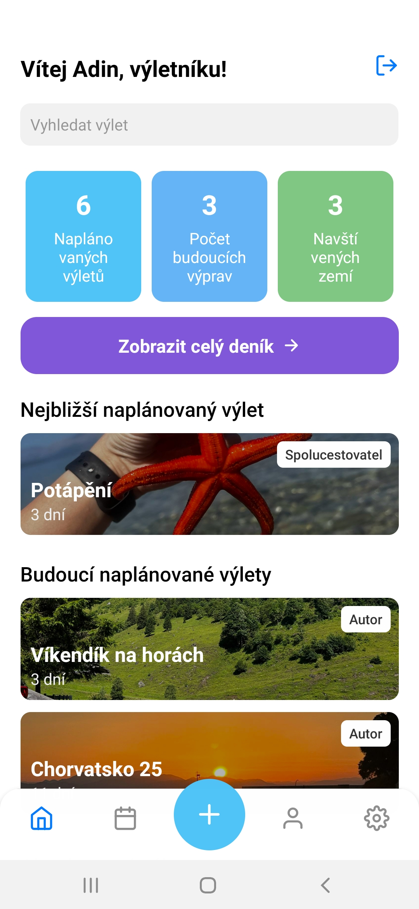
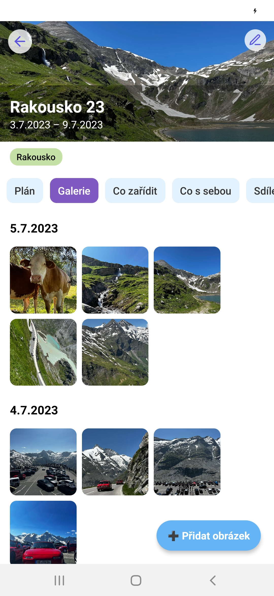
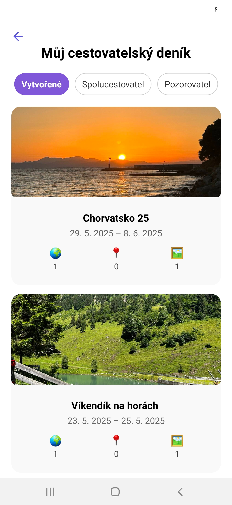
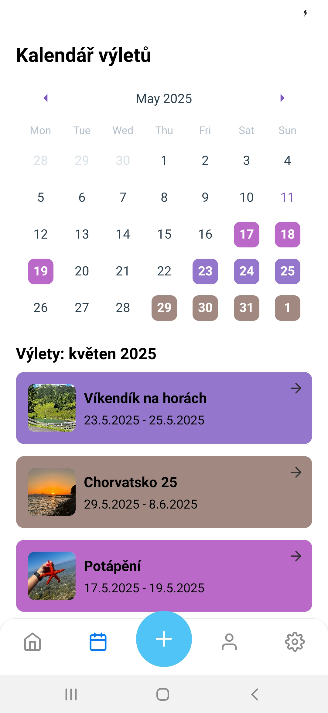
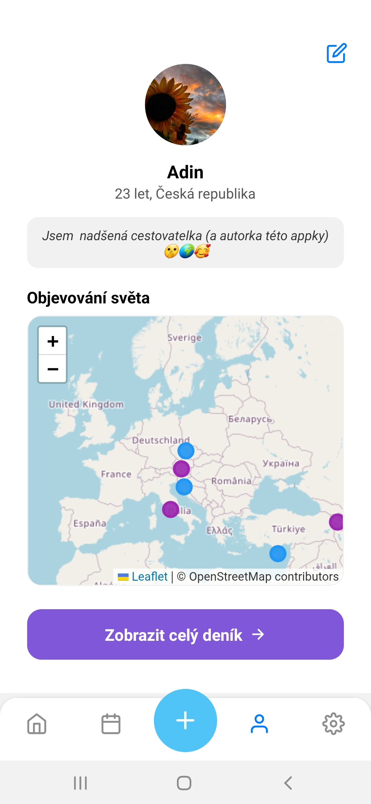

# 🌍 Cestovatelský deník

> Mobilní aplikace **Cestovatelský deník** slouží k plánování a dokumentaci výletů. Můžeš přidávat místa, poznámky, fotky, a sdílet své zážitky s přáteli.  
> Aplikace vznikla jako praktická část bakalářské práce.

---

## ✨ Hlavní funkce

| Funkce             | Popis |
|--------------------|-------|
| 🗺️ **Plánování výletů** | Plánuj, zapisuj a sdílej itineráře. |
| 🖼️ **Fotogalerie**       | Ukládej fotky a zápisky k jednotlivým dnům výletu. |
| ☑️ **Checklisty**        | Co zařídit a Co s sebou – vše přehledně. |
| 👥 **Sdílení**           | Pozvi kamarády a plánujte společně. |

---

## ⚙️ Použité technologie

- **Frontend:** React Native (Expo)
- **Backend:** Node.js (Express) + MySQL + Prisma
- **Autentizace:** JWT (JSON Web Tokens)
- **Hostování:** Raspberry Pi (lokálně)

---

## 🖼️ Ukázky z aplikace

| | | |
|:-:|:-:|:-:|
|  |  |  |
|  |  |  |

---

## 📥 Stažení aplikace

Stáhni si nejnovější verzi aplikace pro Android jako `.apk`:

[⬇️ **Stáhnout APK**](https://littlebunny.fun/cestovatelsky-denik.apk)

---

## 📝 Poznámka
 
© Adéla Kunčíková – pouze pro osobní/studijní účely.